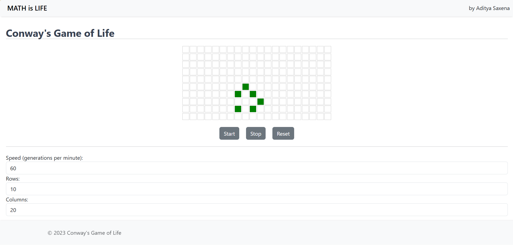

# Conway's Game of Life



## Project Overview
Conway's Game of Life is a cellular automaton devised by the British mathematician John Horton Conway in 1970. It is a zero-player game, meaning that its evolution is determined by its initial state, requiring no further input. The game consists of a grid of cells that can live, die, or multiply based on a few mathematical rules. This project is built using the MERN stack, which stands for MongoDB, Express, React, and Node.js. It features an interactive user interface and is designed as a tutorial to cover key features of React.

## Rules

1. **Birth**: A dead cell with exactly three live neighbors becomes a live cell.
2. **Survival**: A live cell with two or three live neighbors remains alive.
3. **Death by Isolation**: A live cell with fewer than two live neighbors dies.
4. **Death by Overcrowding**: A live cell with more than three live neighbors dies.

The game is played on a two-dimensional grid where each cell interacts with its eight neighbors, which are the cells that are horizontally, vertically, or diagonally adjacent. The initial pattern constitutes the seed of the system. The first generation is created by applying the above rules simultaneously to every cell in the seed—births and deaths occur simultaneously, and the discrete moment at which this happens is sometimes called a tick. The rules continue to be applied repeatedly to create further generations.

## Spiritual Significance
Conway's Game of Life has often been seen as a metaphor for the complexity and unpredictability of life itself. Despite being governed by simple rules, the game can produce incredibly intricate and beautiful patterns, mirroring how simple actions and decisions can lead to complex outcomes in real life. It serves as a reminder of the interconnectedness of all things, where each cell's fate is determined by its neighbors, much like how individuals are influenced by their surroundings and communities.

## How to Download and Run
To download and run this project, follow these steps:

1. Clone the repository to your local machine using the command:
    ```bash
    git clone https://github.com/yourusername/MERN_ConwaysGame.git
    ```
2. Navigate to the project directory:
    ```bash
    cd MERN_ConwaysGame/conways_gol
    ```
3. Install the necessary dependencies:
    ```bash
    npm install
    ```
4. Start the application:
    ```bash
    npm start
    ```

The application should now be running on `http://localhost:3000`.